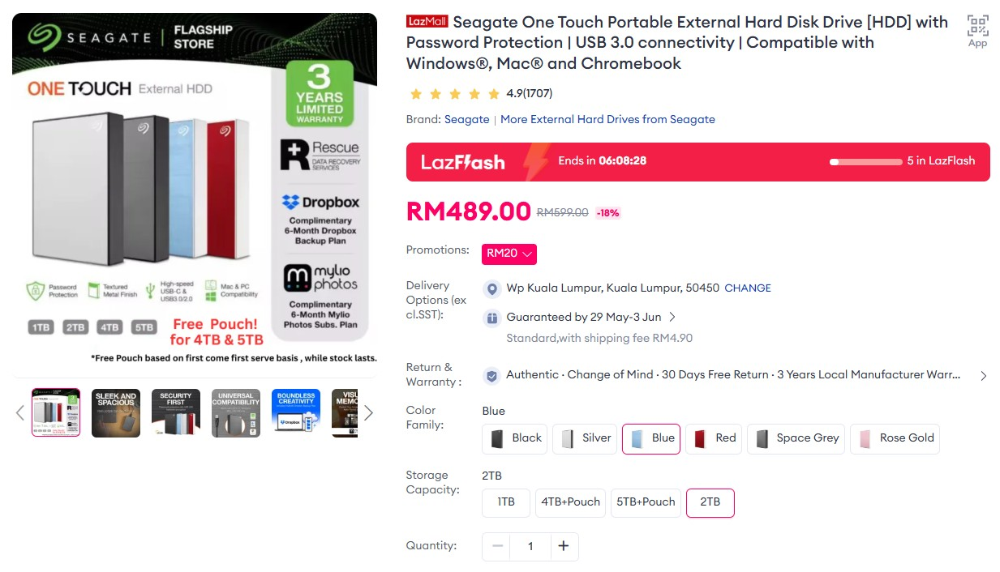
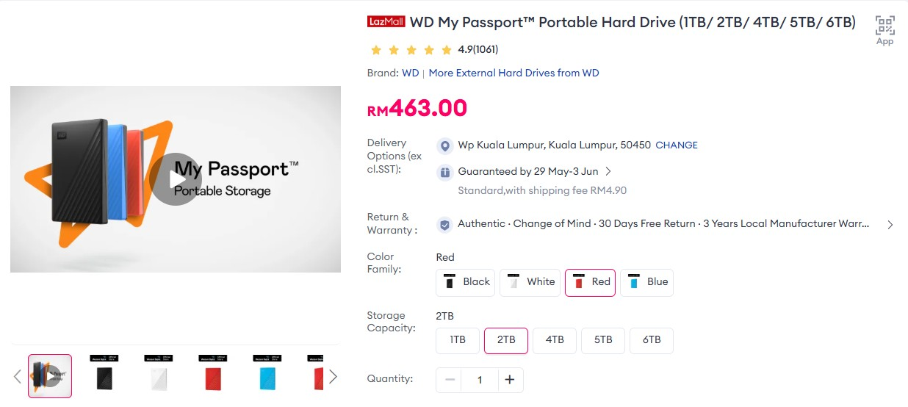
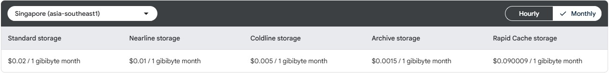

# Dropbox-Alternative

## Project Overview

Dropbox-Alternative is a Google Cloud-based media preview pipeline designed for large-scale media workloads. It watches an inbound Google Cloud Storage bucket for new images and videos, generates smaller preview versions, and writes those previews into a separate preview bucket. The project is built to save cost by keeping original source media in low-cost archive storage while serving lightweight previews from standard storage.

As of June 2026, portable 2TB hard drives are priced around **RM489 for Seagate** and **RM463 for WD**. Hard drive prices have risen by double-digit percentages year-over-year and by a significant cumulative percentage over the past few years. Those price points shown in `seagate.jpg` and `wd.jpg` helped inspire this project as an alternative approach to large media storage and previewing.




With a Singapore region deployment (`asia-southeast1`), this project can be very cost-effective for 2TB of source media because:

- 2TB of source media can be stored in archive storage for roughly **$3/month** in `asia-southeast1`.
- The preview layer is only about 10% of the original size, so 200GB of preview files on standard storage is roughly **$4/month**.
- Network egress from buckets and Cloud Run within `asia-southeast1` is effectively free for intra-region traffic.
- Processing is pay-as-you-go, so you only pay for actual downsizing work instead of a fixed consumer plan.

That means the project can deliver large media capacity and preview generation for around **$7/month in storage alone**, plus a modest Cloud Run processing fee for the downsizing workload.


## How It Works

- The Cloud Function is triggered by GCS upload events for the inbound bucket (for example, `inbound-standard-bucket`).
- It ignores events from the preview bucket (`preview-gallery`) to avoid recursive processing.
- Image files are resized to a maximum of 800×800 pixels and saved as JPEG previews.
- Video files are transcoded to a low-resolution, low-bitrate MP4 proxy for quick preview playback.
- Preview files are uploaded to the preview bucket while preserving the original folder structure.

## Configuration

- The inbound bucket is the event source and is not hardcoded in `main.py`.
- The preview bucket is currently configured in `main.py` as:

```python
PREVIEW_BUCKET_NAME = "preview-gallery"
```

- If you want to use environment variables instead, set `PREVIEW_BUCKET` to `preview-gallery` and update `main.py` accordingly.

## Key Files

- `main.py`: Cloud Function code that handles uploads, processes images/videos, and uploads previews.
- `requirements.txt`: Python dependencies including `google-cloud-storage`, `Pillow`, `functions-framework`, and `cloudevents`.

## 2TB Cost Comparison

This comparison uses the current consumer plan prices and the approximate Google Cloud costs for the project in Singapore.

| Service | Plan | Monthly Cost | Notes |
| --- | --- | --- | --- |
| Google AI Plus | 2TB | MYR 42.99 | Consumer backup/storage plan in Malaysia. |
| Apple iCloud | 2TB | RM 44.90 | Consumer iCloud storage plan in Malaysia. |
| Dropbox | 2TB | $9.99 | Consumer Dropbox plan with sync and sharing. |
| This project | 2TB archive + 200GB preview | ~$7/month storage + processing | Pay-as-you-go storage in `asia-southeast1` with preview generation. |

### Processing fee estimate for 2TB downsizing

Assuming the project processes 2TB of source media using Cloud Run with `0` minimum instances and `512MB` memory, the estimated processing fee is in the range of **$2.50–$3.00** for the full workload.

This estimate assumes a moderate processing throughput and the standard Cloud Run compute pricing model for asia-southeast1. The actual fee may vary depending on the total processing time, number of files, and the mix of images vs. videos.

### Why the cost advantage matters

- Google AI Plus and Apple iCloud are fixed consumer plans with monthly subscription costs.
- Dropbox also charges a fixed monthly fee for 2TB, regardless of usage.
- This project is pay-as-you-go, so the best-case storage cost is substantially lower when the source media can remain in archive storage and only the preview layer is kept in standard storage.
- The combination of archive source storage and small preview storage is what delivers the biggest cost savings.

## Summary

`Dropbox-Alternative` is best suited for individuals who need a self-managed media preview workflow on Google Cloud. For 2TB of source media, the storage cost for this project can be significantly lower than consumer 2TB plans, while still providing automated preview generation and fast media browsing.
